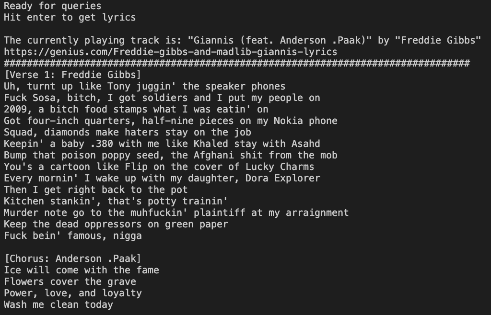

# Lyrify
An application that displays the lyrics for the track currently playing on the user's spotify account.

# Running Lyrify
## Setup
1. Clone this repo
2. Go to [Spotify Dashboard](https://developer.spotify.com/dashboard/applications) and create a new app named lyrify. You should see the Client ID and Client Secret. Copy these to the approriate place under the Spotify object in the config.json file.
3. Go to [Genius Manage API Clients](https://genius.com/api-clients) and create a new API Client called lyrify. The "APP WEBSITE URL" field can be any valid url, for example "https&#65279;://example.com/". Then click on Generate Access Token and copy the value to the config.json file.
## Running
Open a terminal in the top folder of the repository and type `cargo run`. When you run the application for the first time an authorization page will be opened in the browser. If you're prompted to login do so. You have to allow the application. After this you'll be directed to a page that says "Connection refused" or similar. Copy the url and paste it in the terminal. The application should now be ready to display lyrics